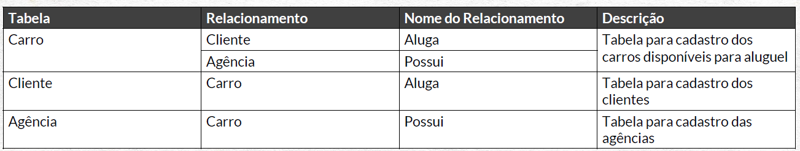
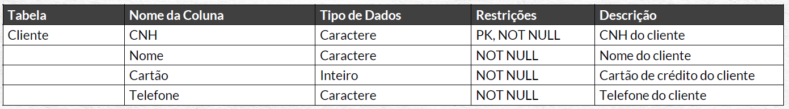
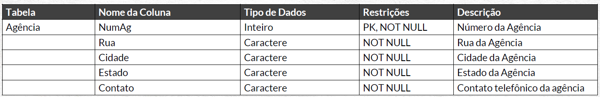
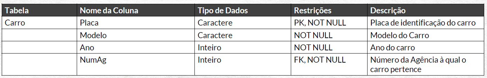

# Carent
Projeto de criação do banco de dados de uma locadora de carros.

**Autor:** Leandro Ferreira

**Data da criação:** 23/01/2024

**Linguagem:** SQL - SQL Server

_____

## Introdução

Este projeto foi desenvolvido com base nas aulas do canal de Youtube Hashtag. https://www.youtube.com/watch?v=Ix0fwZRyBe8&t=532s

Foram disponibilizados os dados iniciais para construção do banco de dados relacional.

## 1. Entendimento do negócio

Para este projeto, devemos modelar os seguintes aspectos:
• Clientes alugam carros em agências.
• 1 cliente pode alugar mais de 1 carro e 1 carro pode ser alugado por mais de 1 pessoa (em uma
determinada data).
• 1 carro pertence a 1 agência e 1 agência pode ter mais de 1 carro.
• As informações de clientes que precisamos armazenar são: CNH, Nome, Cartão e Telefone.
• As informações de carros que precisamos armazenar são: Placa, Modelo, Ano e Agência.
• As informações de agências que precisamos armazenar são: Num Ag, Endereço e Contato.
• Não podemos ter nenhum dado nulo dentro do banco de dados, todas as informações devem ser
sempre preenchidas.

## 2. MER

|Entidades| Atributos              |
|--|--|
CLIENTE   | Nome, Cartão, Telefone |
CARRO     | Modelo, Ano, NumAg     |
AGÊNCIA   | NumAg Endereço, Contato|

Relacionamentos:

- CLIENTE aluga CARRO
- CARRO pertence a AGÊNCIA

## 3. DER

## 4. N:N Cardinalidade

## 5. Normalização de tabelas

A tabela AGÊNCIA possui o atributo Endereço. contudo, o endereço é composto por uma série de dados que podem ser inseridos de forma diferente a depender do usuário. Portanto, é necessário "quebrar" o dado em partes menores.

Endereço --> Rua | Cidade | Estado

## 6. Dicionário de dados

#### Descrição das relações

#### Descrição dos atributos

 

 

## 7. Implementação

O SGBD usado foi o SQL Server os códigos estão disponibilizados em (LINK)

